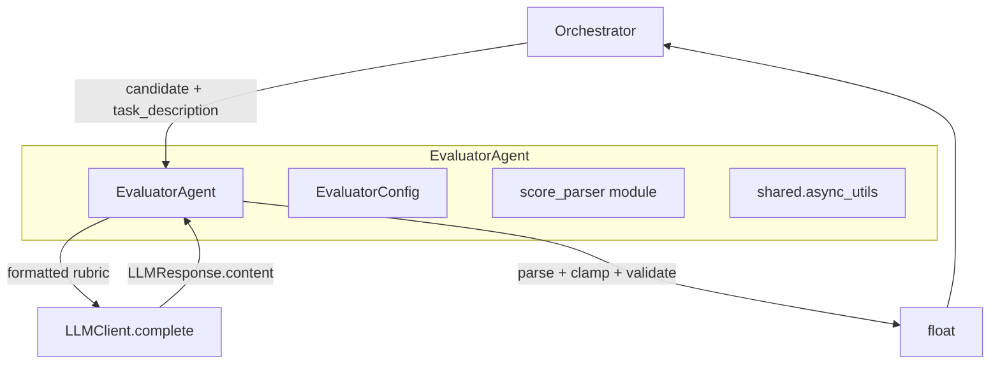
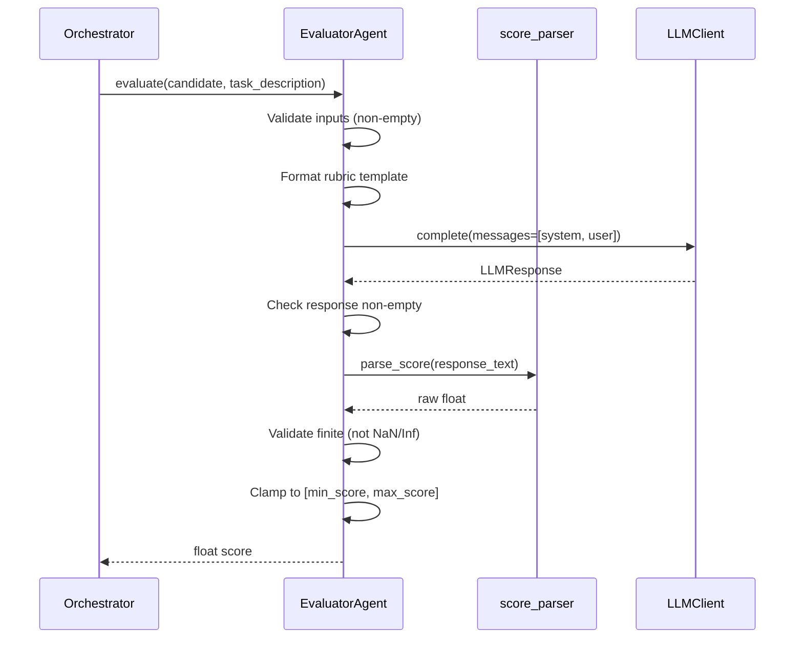

# Design Document: Evaluator Agent

## Overview

The Evaluator Agent is a thin adapter that implements the Orchestrator's `EvaluatorInterface` protocol by delegating to `llm-toolbox`'s `LLMClient` for LLM-as-judge scoring. Unlike the Generator Agent (which uses the full ReAct `Agent` class with tool loops), the Evaluator Agent makes a single LLM completion call per evaluation — it formats a scoring rubric, sends it to the LLM, parses a numeric score from the response, and returns a clamped, finite float.

The agent follows the same patterns established by the Generator Agent: frozen dataclass config, dependency-injected LLMClient and logger, and an async-to-sync bridge for the synchronous `evaluate()` interface.

A key design decision is extracting the async-to-sync bridge (currently duplicated in `GeneratorAgent._run_async` and `tools._run_async_in_thread`) into a shared utility module at `src/shared/async_utils.py`. Both agents will import from this shared location.

## Architecture



### Evaluation Flow



### Design Decisions

- **Single LLM call, no ReAct loop**: Evaluation is a straightforward judge task — no tool use or multi-step reasoning needed. Using `LLMClient.complete()` directly is simpler and faster than spinning up an `Agent`.
- **Shared async-to-sync bridge**: Both `GeneratorAgent` and `EvaluatorAgent` need the same pattern (try `asyncio.run`, fall back to thread if loop is running). Extracting to `src/shared/async_utils.py` eliminates duplication.
- **Score parsing as a separate pure function**: Extracting `parse_score()` into its own module makes it independently testable with property-based tests. The parser handles three formats: number on its own line, JSON `{"score": N}`, or inline number in text.
- **Frozen dataclass config**: Matches the `AgentConfig` pattern from Generator Agent. Immutable after construction, with validation in `__post_init__`.
- **Clamp-then-validate ordering**: Parse → check finiteness → clamp. NaN/Infinity are rejected before clamping since clamping NaN is undefined.

## Components and Interfaces

### EvaluatorConfig (frozen dataclass)

```python
@dataclass(frozen=True)
class EvaluatorConfig:
    rubric_template: str = DEFAULT_RUBRIC_TEMPLATE
    min_score: float = 1.0
    max_score: float = 10.0

    def __post_init__(self) -> None:
        # Validate: rubric non-empty, min < max
        ...
```

### EvaluatorAgent

```python
class EvaluatorAgent:
    def __init__(
        self,
        llm_client: LLMClient,
        config: EvaluatorConfig | None = None,
        agent_logger: logging.Logger | None = None,
    ) -> None: ...

    def evaluate(self, candidate: str, task_description: str) -> float:
        """Synchronous evaluation — satisfies EvaluatorInterface."""
        ...
```

### score_parser module

```python
def parse_score(text: str) -> float:
    """Extract a numeric score from LLM response text.

    Supports:
    1. Number on its own line (e.g., "7.5")
    2. JSON object with "score" key (e.g., '{"score": 7.5}')
    3. Inline number in text (e.g., "I'd rate this a 7.5 out of 10")

    Raises ValueError if no number found.
    """
    ...
```

### shared.async_utils module

```python
def run_async_in_sync(coro: Any) -> Any:
    """Run an async coroutine from sync code.

    Tries asyncio.run() first. If an event loop is already running,
    falls back to running in a separate thread.
    """
    ...
```

## Data Models

### EvaluatorConfig

| Field | Type | Default | Validation |
|---|---|---|---|
| `rubric_template` | `str` | Default rubric (1-10 scale) | Must be non-empty after strip |
| `min_score` | `float` | `1.0` | Must be < `max_score` |
| `max_score` | `float` | `10.0` | Must be > `min_score` |

### Default Rubric Template

The default rubric instructs the LLM to evaluate a prompt candidate on a 1-to-10 scale, considering clarity, specificity, effectiveness, and alignment with the task. It includes `{candidate}` and `{task_description}` placeholders.

### LLM Message Structure

The `evaluate()` method constructs two messages for the LLM call:

1. **System message**: The formatted rubric template (with placeholders filled)
2. **User message**: A short instruction asking the LLM to provide its numeric score

### Score Parsing Priority

The parser tries extraction strategies in order:
1. JSON object with `"score"` key
2. Number alone on a line
3. First number found in text (regex `\d+\.?\d*`)

The first successful extraction wins. This ordering prioritizes structured responses over free-text.


## Correctness Properties

*A property is a characteristic or behavior that should hold true across all valid executions of a system — essentially, a formal statement about what the system should do. Properties serve as the bridge between human-readable specifications and machine-verifiable correctness guarantees.*

### Property 1: Whitespace inputs are rejected

*For any* string composed entirely of whitespace (including the empty string), calling `evaluate()` with that string as either the `candidate` or `task_description` parameter should raise a `ValueError`, and no LLM call should be made.

**Validates: Requirements 1.3, 1.4**

### Property 2: Invalid score range is rejected at config construction

*For any* pair of floats where `min_score >= max_score`, constructing an `EvaluatorConfig` should raise a `ValueError`.

**Validates: Requirements 3.6**

### Property 3: Empty rubric is rejected at config construction

*For any* string composed entirely of whitespace (including the empty string), constructing an `EvaluatorConfig` with that string as the `rubric_template` should raise a `ValueError`.

**Validates: Requirements 3.7**

### Property 4: Rubric template formatting preserves inputs

*For any* rubric template containing `{candidate}` and `{task_description}` placeholders, and *for any* non-empty candidate and task_description strings, the formatted rubric sent to the LLM should contain the literal candidate and task_description text.

**Validates: Requirements 3.3, 4.1**

### Property 5: Score parsing round-trip across formats

*For any* finite float value within a reasonable numeric range, if that value is embedded in a response string in any of the three supported formats (number on its own line, JSON `{"score": N}`, or inline text), `parse_score()` should extract a value equal to the original float.

**Validates: Requirements 5.1, 5.2**

### Property 6: Unparseable responses are rejected

*For any* string that contains no numeric characters, calling `parse_score()` should raise a `ValueError` whose message includes the raw response text.

**Validates: Requirements 5.3**

### Property 7: Score clamping invariant

*For any* valid `EvaluatorConfig` (where `min_score < max_score`) and *for any* finite parsed score, the returned evaluation score should always satisfy `min_score <= score <= max_score`.

**Validates: Requirements 5.4, 6.1**

### Property 8: LLM exceptions propagate as RuntimeError

*For any* exception raised by the `LLMClient.complete()` call, the `evaluate()` method should raise a `RuntimeError` whose cause chain includes the original exception.

**Validates: Requirements 7.3, 8.1**

## Error Handling

| Scenario | Behavior |
|---|---|
| Empty/whitespace `candidate` | Raise `ValueError` with descriptive message |
| Empty/whitespace `task_description` | Raise `ValueError` with descriptive message |
| `min_score >= max_score` in config | Raise `ValueError` at config construction |
| Empty/whitespace `rubric_template` in config | Raise `ValueError` at config construction |
| LLMClient raises exception | Wrap in `RuntimeError` with context, log error, re-raise |
| LLMClient returns empty response | Raise `RuntimeError` with descriptive message |
| LLM response contains no parseable number | Raise `ValueError` including raw response text |
| Parsed score is NaN or Infinity | Raise `ValueError` with descriptive message |
| Parsed score outside [min, max] | Clamp to nearest bound (no error) |

## Testing Strategy

### Property-Based Testing

- **Library**: [Hypothesis](https://hypothesis.readthedocs.io/) for Python
- **Minimum iterations**: 100 per property test
- **Tag format**: `# Feature: evaluator-agent, Property {N}: {title}`

Each of the 8 correctness properties above will be implemented as a single Hypothesis property-based test. Generators will produce:
- Random whitespace-only strings (for input validation properties)
- Random float pairs for score range validation
- Random finite floats embedded in response format strings (for parsing round-trip)
- Random non-numeric strings (for unparseable response property)
- Random valid configs with random scores (for clamping invariant)
- Random exception types (for propagation property)

The `LLMClient` will be mocked in all property tests to control response content and simulate failures.

### Unit Testing

Unit tests complement property tests by covering:
- Protocol conformance: `EvaluatorAgent` satisfies `EvaluatorInterface` (Req 1.2)
- DI behavior: constructor accepts LLMClient, config, logger (Req 2.1, 2.2, 2.3, 3.1, 10.4)
- Default config values: min=1.0, max=10.0, default rubric (Req 9.1, 9.2)
- Frozen config: mutation raises error (Req 9.3)
- Message structure: system message is rubric, user message present (Req 4.2, 4.3)
- NaN/Infinity edge cases: parsed "NaN", "Infinity", "-Infinity" raise ValueError (Req 6.2)
- Empty LLM response: raises RuntimeError (Req 8.2)
- Event loop fallback: evaluate works inside running event loop (Req 7.2)
- Logging: candidate/task length logged on entry, score logged after parse, errors logged (Req 10.1, 10.2, 10.3)

### Test Organization

```
tests/
  test_evaluator_agent.py          # Unit tests for EvaluatorAgent
  test_evaluator_config.py         # Unit + property tests for EvaluatorConfig
  test_score_parser.py             # Unit + property tests for parse_score
  test_async_utils.py              # Unit tests for shared async bridge
  conftest.py                      # Shared fixtures, mock LLMClient
```

### Module Layout

```
src/
  shared/
    __init__.py
    async_utils.py                 # run_async_in_sync() — shared bridge
  evaluator_agent/
    __init__.py
    agent.py                       # EvaluatorAgent class
    config.py                      # EvaluatorConfig frozen dataclass
    score_parser.py                # parse_score() pure function
    prompt_templates.py            # DEFAULT_RUBRIC_TEMPLATE
```
