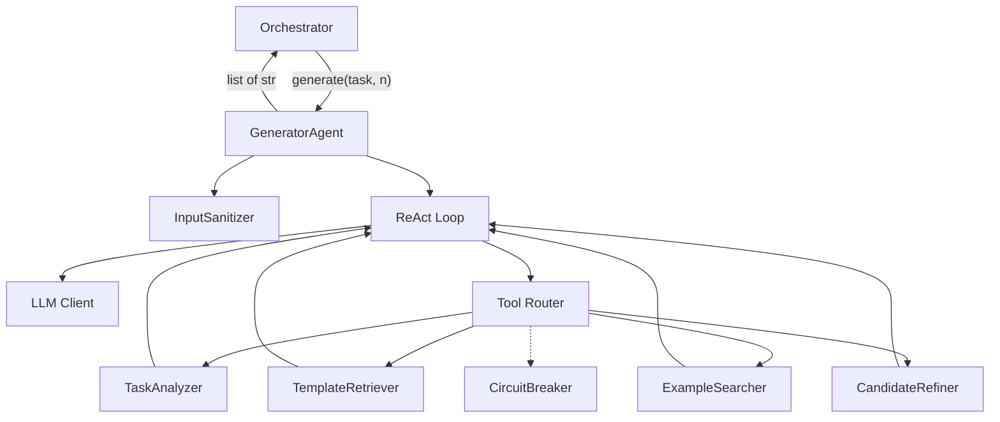
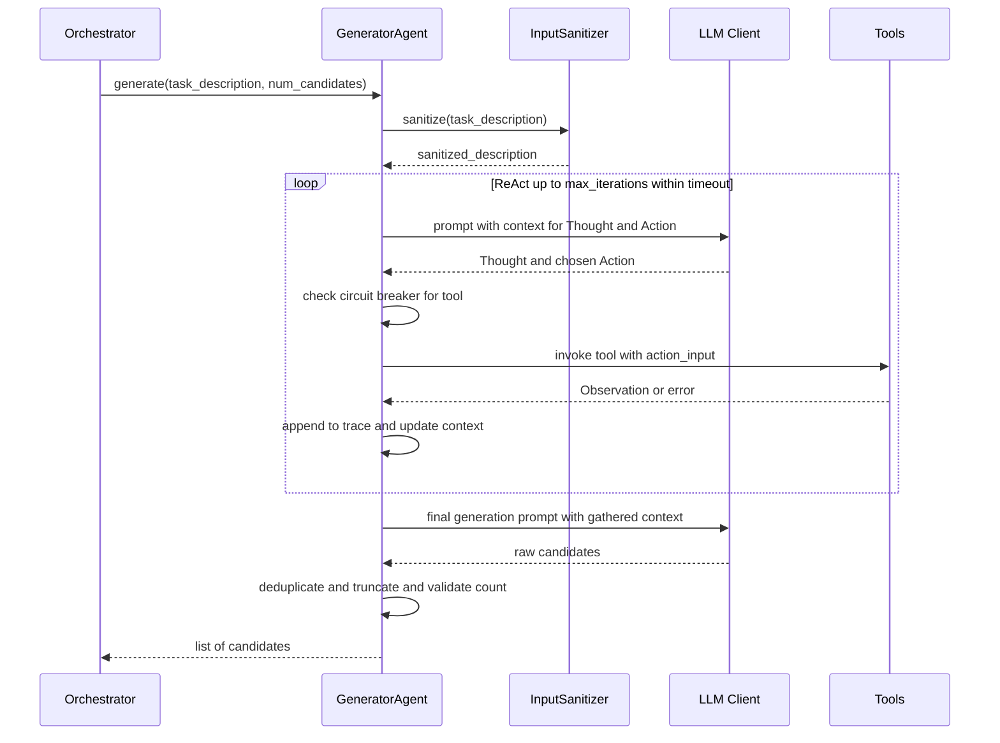

# Design Document: Generator ReAct Agent

## Overview

The Generator ReAct Agent is a concrete implementation of the `GeneratorInterface` protocol that uses a ReAct (Reason + Act) loop to produce diverse, high-quality prompt candidates. Rather than making a single LLM call, the agent iteratively reasons about the task, invokes tools to gather context, and synthesizes findings into candidates.

The agent is injected into the Orchestrator as the `generator` parameter and must satisfy the `GeneratorInterface` protocol — accepting a `task_description` (str) and `num_candidates` (int) and returning `list[str]`.

Key design goals:
- Security-first: Sanitize all inputs before LLM/tool calls; enforce length and token budgets.
- Resilience: Circuit breakers on tools, graceful degradation, configurable timeouts.
- Observability: Structured trace of Thought/Action/Observation steps, logging at every decision point.
- Diversity: Candidates vary across prompting strategies, detail levels, and structures.

## Architecture

### ReAct Loop Sequence

### Design Decisions

- Dataclasses + Protocol: Consistent with the orchestrator's approach. No heavy frameworks.
- Dependency-injected LLM client: The agent never creates its own LLM client — it receives one from llm-toolbox at construction. Tools that need LLM access share the same client.
- Tools as plain callables in a registry: Each tool has a name, description, and input/output contract. The agent selects tools by name during the Action step. Simple and testable in isolation.
- Circuit breaker per tool, per generate call: Failure counts reset at the start of each call. Once a tool trips, it is skipped for the remainder of that call.
- Timeout checked at loop boundaries: Before each iteration and before final generation, elapsed time is checked. This avoids interrupting mid-LLM-call while still enforcing the budget.
- Sanitization as a separate module: Input sanitization logic is isolated so it can be tested independently and reused.
- Token tracking via accumulator: A simple counter tracks tokens consumed across all LLM calls in a generate invocation. The LLM client is expected to return token usage metadata.

## Components

### GeneratorAgent
The main class implementing GeneratorInterface. Accepts an LLM client, optional AgentConfig, and optional logger via dependency injection. Exposes a single `generate(task_description, num_candidates)` method.

### AgentConfig
A dataclass holding all configuration. See Data Models section for fields and defaults.

### LLMClientInterface
A Protocol expected from llm-toolbox. Must expose a `chat(messages, max_tokens)` method returning a response with `content` (str) and `tokens_used` (int).

### ToolInterface
A Protocol for tools. Each tool has a `name` property, a `description` property, and an `invoke(input_text)` method returning a string.

### Tool Implementations
- TaskAnalyzer: Uses LLM client to break down a task description into domain, intent, constraints, and output format.
- TemplateRetriever: Retrieves relevant prompt templates for a query. Returns empty list if none found.
- ExampleSearcher: Finds relevant input-output examples for a task type. Returns empty list if none found.
- CandidateRefiner: Uses LLM client to improve a draft prompt candidate while preserving core intent.

### InputSanitizer
A module with functions for sanitizing task descriptions (reject control chars/null bytes, strip injection patterns, enforce length), sanitizing tool inputs (validate and truncate), and truncating tool outputs.

### CircuitBreaker
A dataclass tracking consecutive failure counts per tool. Trips a tool after reaching the configured threshold. Exposes `record_failure`, `record_success`, `is_tripped`, and `reset` methods.

### ReAct Trace Models
- StepType enum: THOUGHT, ACTION, OBSERVATION
- TraceStep dataclass: step_type, content, optional tool_name, error flag

## Data Models

### AgentConfig

| Field | Type | Default | Validation |
|---|---|---|---|
| max_iterations | int | 5 | Must be >= 1 |
| timeout_seconds | float | 60.0 | Must be > 0 |
| system_prompt_template | str | DEFAULT_SYSTEM_PROMPT | Non-empty |
| circuit_breaker_threshold | int | 3 | Must be >= 1 |
| max_task_description_length | int | 10000 | Must be >= 1 |
| max_tool_input_length | int | 5000 | Must be >= 1 |
| max_tool_output_length | int | 50000 | Must be >= 1 |
| max_tokens_per_llm_call | int | 4096 | Must be >= 1 |
| max_total_tokens | int | 50000 | Must be >= 1 |
| max_candidate_length | int | 5000 | Must be >= 1 |
| max_num_candidates | int | 20 | Must be >= 1 |

### TraceStep

| Field | Type | Description |
|---|---|---|
| step_type | StepType | THOUGHT, ACTION, or OBSERVATION |
| content | str | The text content of this step |
| tool_name | str or None | Tool name for ACTION/OBSERVATION steps |
| error | bool | Whether this step represents an error |

### Validation Rules

| Input | Rule |
|---|---|
| task_description | Non-empty after strip; no control chars or null bytes; within max_task_description_length |
| num_candidates | Must be >= 1 and <= max_num_candidates |
| max_iterations | Must be >= 1 |
| timeout_seconds | Must be > 0 |
| Tool input | Non-empty; no control chars or null bytes; truncated to max_tool_input_length |
| Tool output | Truncated to max_tool_output_length |
| LLM response tokens | Accumulated; generation stops if max_total_tokens exceeded |
| Candidate length | Truncated to max_candidate_length |

## Functional Requirements

### FR-1: Candidate count guarantee
The agent SHALL return exactly the requested number of candidates for any valid input.
Validates: Requirements 1.1, 1.2

### FR-2: Input validation
The agent SHALL reject invalid num_candidates (< 1 or > max_num_candidates) and invalid task descriptions (empty, whitespace-only, control characters, null bytes, exceeds max length) with a ValueError.
Validates: Requirements 1.4, 1.5, 13.2, 13.3, 16.4

### FR-3: ReAct trace ordering
Every Action step in the trace SHALL be immediately preceded by a Thought step and immediately followed by an Observation step.
Validates: Requirements 2.1, 2.2, 2.3, 2.6

### FR-4: Iteration limit enforcement
The number of Action steps SHALL NOT exceed the configured max_iterations.
Validates: Requirements 2.5

### FR-5: Candidate uniqueness
When num_candidates > 1, all returned candidates SHALL be pairwise distinct strings.
Validates: Requirements 7.3

### FR-6: Tool failure handling
A tool failure SHALL produce exactly one error Observation (no retries) and the loop SHALL continue with remaining tools.
Validates: Requirements 9.1, 9.4

### FR-7: Graceful degradation
If all tools fail, the agent SHALL still produce the requested number of candidates using LLM-only generation.
Validates: Requirements 9.2

### FR-8: LLM failure propagation
If the LLM client fails during final candidate generation, the agent SHALL raise an error to the caller.
Validates: Requirements 9.3

### FR-9: Circuit breaker behavior
A tool SHALL be skipped after reaching the configured consecutive failure threshold within a single generate call. Circuit breaker state SHALL reset between generate calls.
Validates: Requirements 12.1, 12.2, 12.5

### FR-10: Prompt injection sanitization
Known injection patterns SHALL be escaped or removed before passing input to the LLM. Raw user input SHALL never appear in system prompts.
Validates: Requirements 13.1, 13.4

### FR-11: Timeout enforcement
If elapsed time exceeds timeout_seconds, the ReAct loop SHALL stop and candidates SHALL be produced with available information. If no information was gathered, a TimeoutError SHALL be raised.
Validates: Requirements 14.2, 14.3

### FR-12: Tool input/output sanitization
Tool inputs with control characters or null bytes SHALL be rejected. Inputs exceeding max_tool_input_length SHALL be truncated. Tool outputs exceeding max_tool_output_length SHALL be truncated.
Validates: Requirements 15.1, 15.2, 15.4

### FR-13: Candidate length enforcement
Candidates exceeding max_candidate_length SHALL be truncated.
Validates: Requirements 16.2

### FR-14: Token budget enforcement
When cumulative tokens across all LLM calls reach max_total_tokens, the ReAct loop SHALL stop and candidates SHALL be produced with available information.
Validates: Requirements 16.3

### FR-15: Config validation
AgentConfig with max_iterations < 1 SHALL be rejected at construction time with a ValueError.
Validates: Requirements 10.3

### FR-16: Tool invocation contract
Each tool SHALL accept a non-empty string input and return a string result. LLM-backed tools SHALL propagate LLM failures.
Validates: Requirements 3.1, 3.4, 4.1, 5.1, 6.1, 6.3

## Non-Functional Requirements

### NFR-1: Security
All user-provided input SHALL be sanitized before reaching the LLM or any tool. The system SHALL defend against prompt injection, control character injection, and resource exhaustion attacks.
Validates: Requirements 13, 15

### NFR-2: Resilience
The agent SHALL degrade gracefully when tools fail (circuit breaker), when the LLM is slow (timeout), or when token budgets are exhausted. It SHALL always attempt to produce candidates rather than fail silently.
Validates: Requirements 9, 12, 14, 16

### NFR-3: Observability
All key events (generate start, thoughts, tool calls, tool failures, circuit breaker trips, sanitization modifications, timeouts, budget exhaustion, completion) SHALL be logged.
Validates: Requirements 11

### NFR-4: Configurability
All limits, thresholds, and templates SHALL be configurable via AgentConfig with sensible defaults.
Validates: Requirements 10, 14.1, 16.1

### NFR-5: Testability
All components (agent, tools, sanitizer, circuit breaker) SHALL be independently testable via dependency injection and Protocol-based interfaces.
Validates: Requirements 8

## Error Handling

| Scenario | Behavior |
|---|---|
| Empty/whitespace task_description | Raise ValueError |
| task_description contains control chars or null bytes | Raise ValueError |
| task_description exceeds max length | Raise ValueError |
| num_candidates < 1 or > max_num_candidates | Raise ValueError |
| max_iterations < 1 in config | Raise ValueError at construction |
| Tool invocation fails | Record error Observation, continue loop |
| Tool circuit-broken | Skip tool, log warning, record in trace |
| All tools fail | Fall back to LLM-only generation |
| LLM fails during ReAct reasoning | Log error, exit loop, attempt final generation |
| LLM fails during final generation | Raise RuntimeError |
| Timeout exceeded with context | Exit loop, produce candidates |
| Timeout exceeded without context | Raise TimeoutError |
| Token budget exhausted | Exit loop, produce candidates |
| Tool input contains control chars | Reject input, record error Observation |
| Tool output exceeds max length | Truncate, log warning |
| Candidate exceeds max length | Truncate |
| Sanitization modifies input | Log warning |
| Duplicate candidates generated | Deduplicate and regenerate to fill count |

### Exception Types

| Exception | When |
|---|---|
| ValueError | Invalid inputs: bad task_description, bad num_candidates, bad config |
| TimeoutError | Generate call exceeds timeout with no useful context gathered |
| RuntimeError | LLM client fails during final candidate generation |

## Testing Strategy

### Unit Testing
- All GeneratorAgent tests in a single test_generator_agent.py
- Separate test files for sanitization, tools, and circuit breaker modules
- Mock LLM client and tools for isolation
- No magic strings or numbers — use named constants
- Follow DRY — shared fixtures in conftest.py

### Test Organization

| File | Covers |
|---|---|
| test_generator_agent.py | Agent logic, config, logging, edge cases |
| test_sanitization.py | Input sanitization module |
| test_tools.py | Individual tool implementations |
| test_circuit_breaker.py | Circuit breaker logic |
| conftest.py | Shared fixtures, mock LLM client, mock tools |
