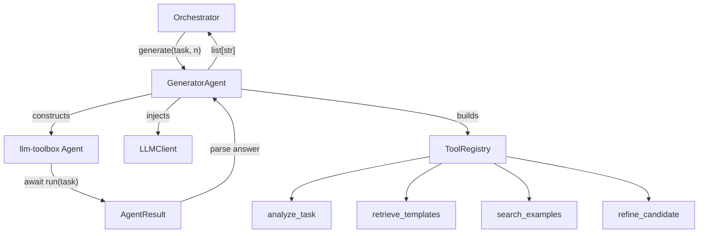
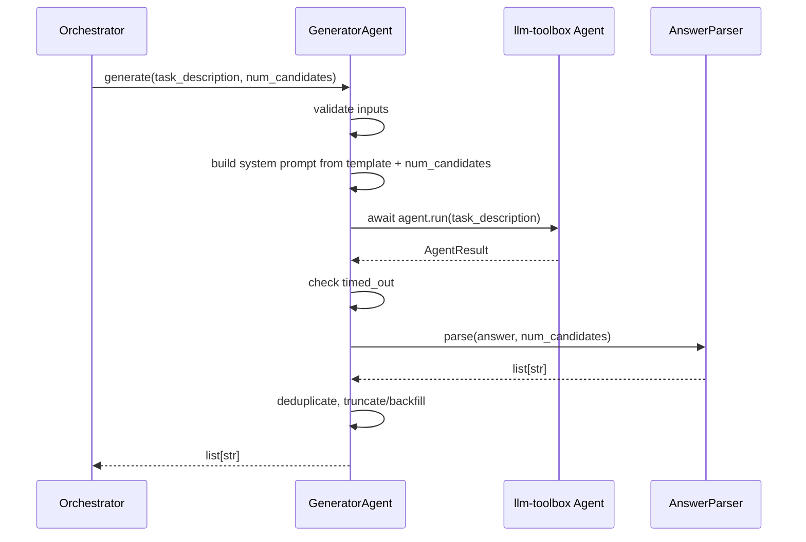

# Design Document: Generator ReAct Agent

## Overview

The Generator ReAct Agent is a thin adapter that implements the Orchestrator's `GeneratorInterface` protocol by delegating to the `llm-toolbox` library's `Agent` class. The llm-toolbox library already provides the async ReAct loop, LLM client with retry/backoff, tool registry with JSON schema generation and argument validation, and structured result models (`AgentResult`, `ReActStep`, etc.).

This adapter's responsibilities are narrow:

1. Satisfy the `GeneratorInterface` protocol (`generate(task_description, num_candidates) -> list[str]`)
2. Configure and instantiate an llm-toolbox `Agent` with custom tools and a system prompt
3. Parse `AgentResult.answer` into a `list[str]` of prompt candidates
4. Bridge async `agent.run()` to the sync `generate()` contract
5. Handle timeout, parse failure, and count mismatches

Everything else — the ReAct loop, tool dispatch, LLM retries, backoff, schema validation — is llm-toolbox's job.

## Architecture



### Sequence: generate() call



### Design Decisions

| Decision | Rationale |
|---|---|
| Thin adapter over llm-toolbox | Avoids reimplementing ReAct loop, retries, tool dispatch. Keeps codebase small and focused. |
| Dependency-injected LLMClient | GeneratorAgent never creates its own LLMClient. Receives one at construction, passes it to llm-toolbox Agent. Testable with mocks. |
| Tools as plain functions | Each tool is a regular Python function registered via `ToolRegistry.register_from_function()`. Simple, testable, no class hierarchy needed. |
| `asyncio.run()` with running-loop detection | The sync `generate()` wraps async `agent.run()`. Detects already-running event loops and falls back to thread-based execution to support Jupyter/async contexts. |
| Answer parsing with multiple format support | LLMs may format answers as numbered lists, JSON arrays, or delimiter-separated text. Parser tries each format in order. |
| Dataclass for config | Consistent with orchestrator's approach. Immutable, validated at construction. |
| No circuit breakers or sanitization modules | llm-toolbox handles tool error recovery and the ReAct loop already handles tool failures gracefully. Input validation is simple ValueError checks. |

## Components and Interfaces

### GeneratorAgent

The main class. Implements `GeneratorInterface`.

```python
class GeneratorAgent:
    def __init__(
        self,
        llm_client: LLMClient,
        config: AgentConfig | None = None,
        logger: logging.Logger | None = None,
    ) -> None: ...

    def generate(self, task_description: str, num_candidates: int) -> list[str]: ...
```

- Accepts an `LLMClient` (from llm-toolbox) via DI
- Accepts optional `AgentConfig` (defaults provided)
- Accepts optional `Logger` (defaults to module-level logger)
- `generate()` is synchronous — bridges to async internally

### AgentConfig

Configuration dataclass with sensible defaults.

```python
@dataclass(frozen=True)
class AgentConfig:
    max_iterations: int = 5
    enabled_tools: frozenset[str] = frozenset({
        "analyze_task", "retrieve_templates",
        "search_examples", "refine_candidate"
    })
    system_prompt_template: str = DEFAULT_SYSTEM_PROMPT
```

### Tool Functions

Four plain functions, registered with `ToolRegistry.register_from_function()`:

| Function | Signature | Description |
|---|---|---|
| `analyze_task` | `(task_description: str) -> str` | Breaks down task into domain, intent, constraints, output format. Uses LLMClient via closure. |
| `retrieve_templates` | `(query: str) -> str` | Returns relevant prompt templates for the query. Returns "no templates found" if empty. |
| `search_examples` | `(task_type: str) -> str` | Returns relevant few-shot examples. Returns "no examples found" if empty. |
| `refine_candidate` | `(draft: str) -> str` | Improves a draft prompt candidate. Uses LLMClient via closure. |

Tools that need LLM access (`analyze_task`, `refine_candidate`) receive the `LLMClient` via closure at registration time — the registered function closes over the client instance.

### Answer Parser

A module-level function (or small set of functions) that extracts individual candidates from `AgentResult.answer`:

```python
def parse_candidates(answer: str, num_candidates: int) -> list[str]: ...
```

Parsing strategy (tried in order):
1. JSON array — `json.loads(answer)` if it looks like `[...]`
2. Numbered list — regex for `1. ...`, `2. ...` etc.
3. Delimiter-based — split on `---` or `===`
4. Fallback — treat entire answer as single candidate

### ToolRegistry Builder

A helper function that builds a `ToolRegistry` with the enabled tools:

```python
def build_tool_registry(
    llm_client: LLMClient,
    enabled_tools: frozenset[str],
) -> ToolRegistry: ...
```

## Data Models

### AgentConfig

| Field | Type | Default | Validation |
|---|---|---|---|
| `max_iterations` | `int` | `5` | Must be >= 1 |
| `enabled_tools` | `frozenset[str]` | All four tools | Each must be a known tool name |
| `system_prompt_template` | `str` | `DEFAULT_SYSTEM_PROMPT` | Non-empty after strip |

### System Prompt Template

The default system prompt template is a string with `{num_candidates}` placeholder:

```
You are a prompt engineering expert. Your task is to generate exactly {num_candidates} diverse prompt candidates for the given task.

Use the available tools to analyze the task, find relevant templates and examples, and refine your candidates.

Requirements:
- Each candidate must be a complete, self-contained prompt
- Candidates must vary across: instruction style, detail level, use of examples, output format
- Use tools to gather context before generating candidates

Format your final answer as a numbered list:
1. [first candidate]
2. [second candidate]
...
```

### Validation Rules

| Input | Rule | Error |
|---|---|---|
| `task_description` | Non-empty after strip | `ValueError` |
| `num_candidates` | >= 1 | `ValueError` |
| `max_iterations` (config) | >= 1 | `ValueError` at construction |
| `enabled_tools` (config) | Subset of known tool names | `ValueError` at construction |
| `system_prompt_template` (config) | Non-empty after strip | `ValueError` at construction |


## Correctness Properties

*A property is a characteristic or behavior that should hold true across all valid executions of a system — essentially, a formal statement about what the system should do. Properties serve as the bridge between human-readable specifications and machine-verifiable correctness guarantees.*

### Property 1: Candidate count guarantee

*For any* valid task description and any num_candidates >= 1, calling `generate(task_description, num_candidates)` SHALL return a list of exactly `num_candidates` strings.

**Validates: Requirements 1.1, 1.2, 4.3**

### Property 2: Invalid input rejection

*For any* num_candidates < 1, `generate()` SHALL raise a `ValueError`. *For any* task description that is empty or composed entirely of whitespace characters, `generate()` SHALL raise a `ValueError`. *For any* `AgentConfig` with `max_iterations` < 1, construction SHALL raise a `ValueError`.

**Validates: Requirements 1.4, 1.5, 13.3**

### Property 3: Parsing round-trip

*For any* list of N distinct non-empty strings, formatting them as a numbered list and then parsing with `parse_candidates()` SHALL produce the same N strings (after stripping whitespace).

**Validates: Requirements 4.1, 4.2**

### Property 4: Unparseable answer raises RuntimeError

*For any* `AgentResult` whose `answer` is empty or None, `generate()` SHALL raise a `RuntimeError` with a descriptive message.

**Validates: Requirements 4.4**

### Property 5: Tool registry respects enabled_tools config

*For any* subset of the four known tool names provided as `enabled_tools` in `AgentConfig`, the built `ToolRegistry` SHALL contain exactly those tools and no others.

**Validates: Requirements 5.3**

### Property 6: Tool functions return non-empty strings

*For any* valid non-empty string input, each tool function (`analyze_task`, `retrieve_templates`, `search_examples`, `refine_candidate`) SHALL return a non-empty string.

**Validates: Requirements 6.1, 7.1, 8.1, 9.1**

### Property 7: System prompt includes num_candidates

*For any* positive integer num_candidates, the constructed system prompt SHALL contain the string representation of that integer.

**Validates: Requirements 10.1**

### Property 8: Output candidates are stripped and unique

*For any* successful `generate()` call with num_candidates > 1, all returned candidates SHALL have no leading or trailing whitespace, and all candidates SHALL be pairwise distinct.

**Validates: Requirements 11.1, 11.3**

### Property 9: Agent exceptions wrapped in RuntimeError

*For any* exception raised by `agent.run()`, `generate()` SHALL raise a `RuntimeError` whose `__cause__` is the original exception.

**Validates: Requirements 12.3**

## Error Handling

| Scenario | Behavior | Exception |
|---|---|---|
| Empty/whitespace `task_description` | Raise immediately | `ValueError` |
| `num_candidates` < 1 | Raise immediately | `ValueError` |
| `max_iterations` < 1 in config | Raise at construction | `ValueError` |
| Unknown tool name in `enabled_tools` | Raise at construction | `ValueError` |
| Empty `system_prompt_template` | Raise at construction | `ValueError` |
| `AgentResult.timed_out` is True, answer is empty | Raise with iteration count | `TimeoutError` |
| `AgentResult.timed_out` is True, answer is non-empty | Attempt to parse available candidates | — |
| `AgentResult.answer` is empty or unparseable | Raise with context | `RuntimeError` |
| `agent.run()` raises any exception | Wrap and re-raise with context | `RuntimeError` |
| Parsed count < num_candidates after dedup | Attempt follow-up `agent.run()` for more | — |
| Parsed count > num_candidates | Truncate to num_candidates | — |
| Running event loop detected in `generate()` | Fall back to thread-based async execution | — |

## Testing Strategy

### Property-Based Testing

This feature is well-suited for property-based testing. The core logic involves input validation, parsing, and data transformations with clear universal properties.

- Library: `hypothesis` (already in dev dependencies)
- Minimum 100 iterations per property test
- Each property test tagged with: `Feature: generator-react-agent, Property {N}: {title}`

### Unit Testing

Unit tests cover specific examples, integration wiring, edge cases, and logging:

- Mock `LLMClient` and `Agent` for isolation (never call real LLMs)
- Mock `Agent.run()` to return controlled `AgentResult` instances
- Verify logging output with captured log records
- Test each tool function independently with mocked LLMClient

### Test Organization

| File | Covers |
|---|---|
| `test_generator_agent.py` | GeneratorAgent: generate(), config validation, error handling, logging, async bridging |
| `test_answer_parser.py` | parse_candidates(): all formats, edge cases, round-trip properties |
| `test_tools.py` | Tool functions: analyze_task, retrieve_templates, search_examples, refine_candidate |
| `conftest.py` | Shared fixtures: mock LLMClient, mock Agent, sample AgentResults, AgentConfig factories |

### What We Test vs. What We Don't

- We test: GeneratorAgent logic, answer parsing, tool functions, config validation, error handling
- We don't test: llm-toolbox internals (Agent ReAct loop, ToolRegistry schema generation, LLMClient retry logic)
