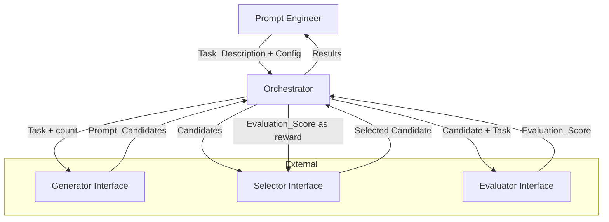
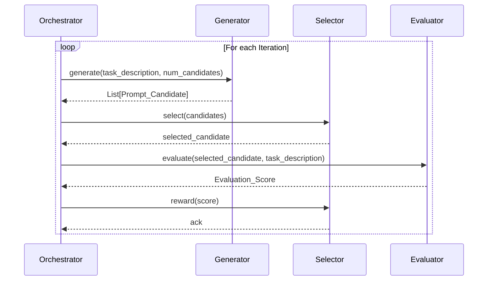

# Design Document: Prompt Optimization Orchestrator

## Overview

The Prompt Optimization Orchestrator is a coordination layer that manages the lifecycle of prompt optimization runs. It ties together three components:

1. **Generator** — an LLM that produces prompt candidates from a task description (via `llm-toolbox`)
2. **Selector** — an RL agent that picks the best candidate (via `prompt-selection-rl-agent`)
3. **Evaluator** — an LLM that scores prompt quality (via `llm-toolbox`)

The Orchestrator runs iterative optimization loops: in each iteration it generates candidates, selects the best one, evaluates it, and feeds the score back to the Selector as a reward signal. After all iterations complete, it returns the best-scoring prompt.

The system is designed as a pure Python library with dependency-injected components, making it testable and allowing components to be swapped independently.

## Architecture



### Iteration Flow



### Design Decisions

- **Python with dataclasses and Protocol types**: Lightweight, no heavy framework. Protocols define component interfaces for duck-typing compatibility.
- **Sequential iteration execution**: Iterations run sequentially because the RL Selector's policy update from iteration N informs selection in iteration N+1.
- **Retry with configurable limit**: Each external component call (Generator, Selector, Evaluator) retries up to a configurable limit before marking the iteration as failed.
- **Abort threshold**: If more than half of iterations fail, the run aborts early to avoid wasting resources.
- **JSON serialization**: Run state serializes to JSON for persistence and inspection, using a custom encoder/decoder for dataclass round-tripping.

## Components and Interfaces

### Generator Interface (Protocol)

```python
class GeneratorInterface(Protocol):
    def generate(self, task_description: str, num_candidates: int) -> list[str]:
        """Generate prompt candidates for a task description."""
        ...
```

### Selector Interface (Protocol)

```python
class SelectorInterface(Protocol):
    def select(self, candidates: list[str]) -> str:
        """Select the best candidate from a list."""
        ...

    def reward(self, score: float) -> None:
        """Send evaluation score as reward signal."""
        ...
```

### Evaluator Interface (Protocol)

```python
class EvaluatorInterface(Protocol):
    def evaluate(self, candidate: str, task_description: str) -> float:
        """Evaluate a prompt candidate and return a numeric score."""
        ...
```

### Orchestrator Class

```python
class Orchestrator:
    def __init__(
        self,
        generator: GeneratorInterface,
        selector: SelectorInterface,
        evaluator: EvaluatorInterface,
        logger: logging.Logger | None = None,
    ): ...

    def start_run(self, task_description: str, config: OptimizationConfig) -> str:
        """Validate inputs, create a run, return run_id."""
        ...

    def execute_run(self, run_id: str) -> OptimizationResult:
        """Execute all iterations for a run and return results."""
        ...

    def get_run(self, run_id: str) -> OptimizationRun:
        """Retrieve current state of a run by ID."""
        ...
```

### Serialization Module

```python
def serialize_run(run: OptimizationRun) -> str:
    """Serialize an OptimizationRun to a JSON string."""
    ...

def deserialize_run(json_str: str) -> OptimizationRun:
    """Deserialize a JSON string back to an OptimizationRun."""
    ...
```

## Data Models

```python
from dataclasses import dataclass, field
from enum import Enum
import uuid

class IterationStatus(Enum):
    PENDING = "pending"
    IN_PROGRESS = "in_progress"
    COMPLETE = "complete"
    FAILED = "failed"
    DEGRADED = "degraded"

class RunStatus(Enum):
    PENDING = "pending"
    IN_PROGRESS = "in_progress"
    COMPLETE = "complete"
    ABORTED = "aborted"

@dataclass
class OptimizationConfig:
    num_candidates: int          # positive integer
    num_iterations: int          # positive integer
    retry_limit: int = 3         # max retries per component call
    evaluation_criteria: str = ""  # optional description of eval criteria

@dataclass
class IterationResult:
    iteration_number: int
    status: IterationStatus
    candidates: list[str] = field(default_factory=list)
    selected_candidate: str | None = None
    evaluation_score: float | None = None
    error: str | None = None

@dataclass
class OptimizationRun:
    run_id: str
    task_description: str
    config: OptimizationConfig
    status: RunStatus = RunStatus.PENDING
    iterations: list[IterationResult] = field(default_factory=list)

@dataclass
class OptimizationResult:
    run_id: str
    status: RunStatus
    best_candidate: str | None
    best_score: float | None
    iterations: list[IterationResult]
```

### Validation Rules

| Field | Rule |
|---|---|
| `task_description` | Must be a non-empty string (after stripping whitespace) |
| `num_candidates` | Must be a positive integer (> 0) |
| `num_iterations` | Must be a positive integer (> 0) |
| `retry_limit` | Must be a non-negative integer (>= 0) |
| `evaluation_score` | Must be a finite float (not NaN, not Inf) |
| `selected_candidate` | Must exist in the original candidate set |


## Correctness Properties

*A property is a characteristic or behavior that should hold true across all valid executions of a system — essentially, a formal statement about what the system should do. Properties serve as the bridge between human-readable specifications and machine-verifiable correctness guarantees.*

### Property 1: Run creation produces unique identifiers

*For any* two calls to `start_run` with valid inputs, the returned run identifiers should be distinct.

**Validates: Requirements 1.1**

### Property 2: Empty task descriptions are rejected

*For any* string composed entirely of whitespace (including the empty string), calling `start_run` should raise a validation error and no Optimization_Run should be created.

**Validates: Requirements 1.2, 1.4**

### Property 3: Invalid config values are rejected

*For any* Optimization_Config where `num_candidates` or `num_iterations` is not a positive integer, calling `start_run` should raise a validation error listing the invalid fields.

**Validates: Requirements 1.3, 1.5**

### Property 4: Component argument passing integrity

*For any* valid Optimization_Run, during each iteration the Orchestrator should pass the exact `task_description` and `num_candidates` to the Generator, the full candidate list to the Selector, the selected candidate and `task_description` to the Evaluator, and the evaluation score to the Selector's reward method.

**Validates: Requirements 2.1, 3.1, 4.1, 5.1**

### Property 5: Retry behavior on component failure

*For any* component (Generator, Selector, or Evaluator) that raises an error, and *for any* positive retry limit in the Optimization_Config, the Orchestrator should retry the call exactly `retry_limit` times before marking the Iteration as failed.

**Validates: Requirements 2.5, 3.4, 4.4**

### Property 6: Selected candidate membership invariant

*For any* set of Prompt_Candidates and any candidate returned by the Selector, if the returned candidate is not a member of the original candidate set, the Orchestrator should mark the Iteration as failed with a data integrity error.

**Validates: Requirements 3.2, 3.3**

### Property 7: Evaluation score finiteness validation

*For any* value returned by the Evaluator, if the value is not a finite number (i.e., it is NaN, Infinity, or non-numeric), the Orchestrator should mark the Iteration as failed with a validation error.

**Validates: Requirements 4.2, 4.3**

### Property 8: Successful iteration completeness

*For any* Iteration that completes without error, the Iteration status should be COMPLETE and the result should contain a non-null `selected_candidate`, a non-null `evaluation_score`, and a non-empty `candidates` list.

**Validates: Requirements 5.2, 6.2**

### Property 9: Iteration count matches configuration

*For any* Optimization_Run that completes (is not aborted), the number of IterationResults should equal the `num_iterations` specified in the Optimization_Config.

**Validates: Requirements 6.1**

### Property 10: Abort on majority failure

*For any* Optimization_Run where more than half of the Iterations have status FAILED, the Orchestrator should abort the run (set status to ABORTED) and stop executing further iterations.

**Validates: Requirements 6.4**

### Property 11: Iteration status validity

*For any* IterationResult in an Optimization_Run, the status should be one of: PENDING, IN_PROGRESS, COMPLETE, FAILED, or DEGRADED.

**Validates: Requirements 6.5**

### Property 12: Best candidate has highest score

*For any* completed Optimization_Run with at least one successful iteration, the returned best candidate should have the highest Evaluation_Score among all completed iterations. If multiple candidates share the highest score, the candidate from the latest iteration should be returned.

**Validates: Requirements 7.1, 7.4**

### Property 13: Run lookup returns current state

*For any* valid run identifier, calling `get_run` should return an OptimizationRun whose `run_id` matches the queried identifier and whose data reflects the current state of the run.

**Validates: Requirements 7.3**

### Property 14: Serialization round-trip

*For any* valid OptimizationRun state, serializing to JSON and then deserializing should produce an OptimizationRun that is equivalent to the original.

**Validates: Requirements 10.1, 10.2, 10.3**

## Error Handling

| Scenario | Behavior |
|---|---|
| Empty/whitespace `task_description` | Raise `ValidationError` with message indicating task description is required |
| Invalid `Optimization_Config` fields | Raise `ValidationError` listing each invalid field and why |
| Generator returns 0 candidates | Mark iteration as FAILED, record error |
| Generator returns fewer than requested | Log warning, proceed with available candidates |
| Generator/Selector/Evaluator timeout or connection error | Retry up to `retry_limit`, then mark iteration as FAILED |
| Selector returns candidate not in set | Mark iteration as FAILED with data integrity error |
| Evaluator returns non-finite score | Mark iteration as FAILED with validation error |
| Selector fails to accept reward | Log failure, mark iteration as DEGRADED, continue to next iteration |
| >50% iterations failed | Abort run, set status to ABORTED, return failure summary |
| Malformed JSON on deserialization | Raise `DeserializationError` listing invalid/missing fields |
| Unknown `run_id` in `get_run` | Raise `RunNotFoundError` |

### Exception Hierarchy

```python
class OrchestratorError(Exception): ...
class ValidationError(OrchestratorError): ...
class DeserializationError(OrchestratorError): ...
class RunNotFoundError(OrchestratorError): ...
class ComponentError(OrchestratorError): ...
class DataIntegrityError(OrchestratorError): ...
```

## Testing Strategy

### Property-Based Testing

- **Library**: [Hypothesis](https://hypothesis.readthedocs.io/) for Python
- **Minimum iterations**: 100 per property test
- **Tag format**: `# Feature: prompt-optimization-orchestrator, Property {N}: {title}`

Each of the 14 correctness properties above will be implemented as a single Hypothesis property-based test. Generators will produce:
- Random non-empty strings for task descriptions
- Random positive integers for config values
- Random lists of candidate strings
- Random finite floats for evaluation scores
- Random OptimizationRun states (for serialization round-trip)

Component interfaces will be mocked to control behavior (e.g., inject failures, return specific candidates).

### Unit Testing

Unit tests complement property tests by covering:
- Specific examples: a concrete happy-path run with known inputs/outputs
- Edge cases: empty candidate list from generator, NaN scores, reward rejection (degraded iteration)
- Logging verification: capture log output and assert expected log messages for run start, iteration start, component failures, and run completion (Requirements 9.1–9.4)
- Deserialization of malformed JSON (Requirement 10.4)
- Generator returning fewer candidates than requested (Requirement 2.3)

### Test Organization

```
tests/
  test_orchestrator_properties.py   # 14 property-based tests
  test_orchestrator_unit.py         # Unit tests for examples, edge cases, logging
  conftest.py                       # Shared fixtures, mock components
```
